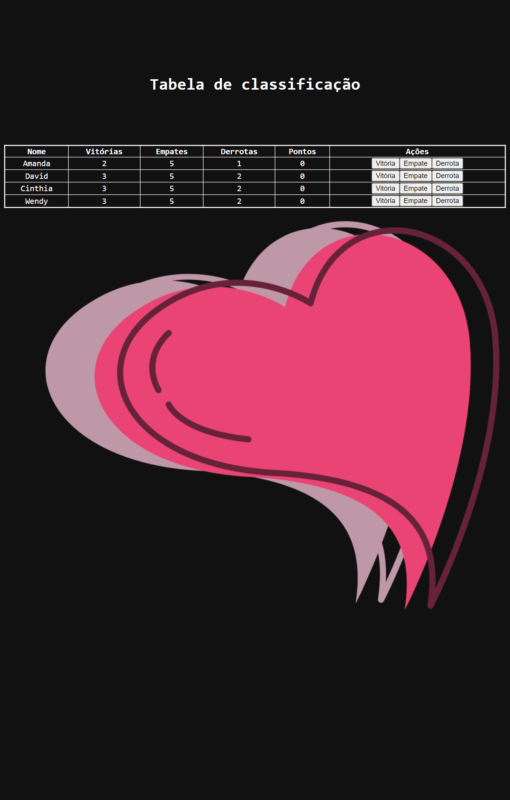

# Tabela de Classificação

Neste projeto utilzei javascript para renderizar uma lista dinâmicamente.

A lista renderizada possui botões que atribuem pontos por tipo para cada jogador. Os valores são exibidos de forma automática na tabela.

Separei as regras em funções para simplificar o projeto.
  

